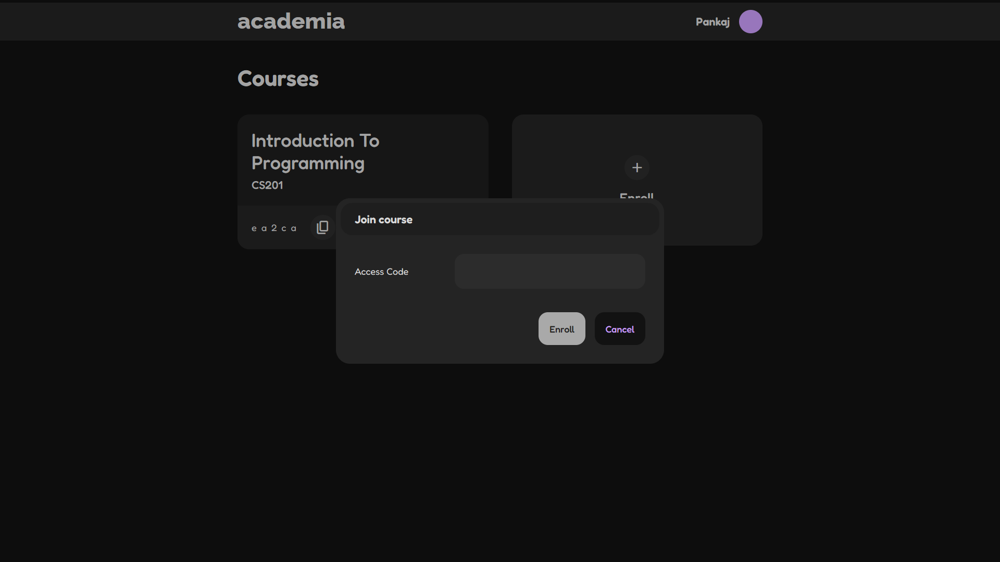

# academia


### About

Platform developed for educational institutions that aims for creating, distributing and grading assignments streamlining the process between professors and their pupils.

### Development

-   Install Dependencies.

```sh
npm install
```

-   Run Development Server.

```sh
npm start
```

-   Run Sass Configuration.

```sh
npm run sass
```

---

### Backend

-   Refer to [academia-backend](https://github.com/avi-spc/academia-backend) repo and follow instructions to setup a backend server.

---

### Technologies Used

##### Back End

-   [Node](https://nodejs.org)
-   [Express](http://expressjs.com)
-   [MongoDB](http://mongodb.com)
-   [Mongoose](http://mongoosejs.com)

##### Front End

-   [React](https://reactjs.org)
-   [Sass](https://sass-lang.com/)

##### State Management

-   [Redux](https://redux.js.org)

### Screenshots

#### Instructor

#### SignIn / SignUp


#### Course Content


#### Creation Forms


#### Student

#### SignIn / SignUp


#### Course Content


#### Submission Forms



#### Common Content


